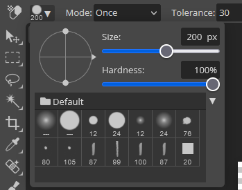
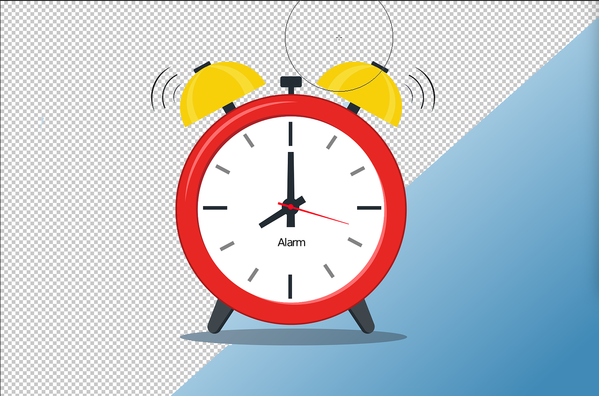
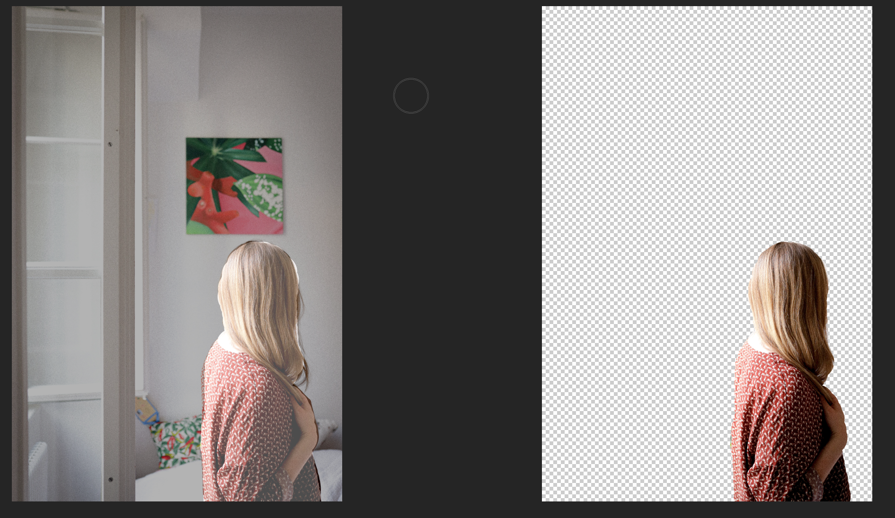

# Photopea Bonus Activity: Removing the Background from Images
If you have a graphic or photo and need to get rid of the background and convert it to a transparent background, you may find this guide helpful. If you have any questions, please ask!

1. Download this image for the exercise: [Pixabay Image](https://pixabay.com/vectors/alarm-time-flat-wake-up-sleep-3122687/){:target="_blank"}
2. Open the photo in Photopea by either clicking on the **Open From Computer** or going to **File -> Open**. Find where you saved the photo and open it. If your browser automatically saved it for you, it is probably in your **Downloads** folder. 

## Method #1: Background Eraser “Once Mode”
1. Find the **Background Eraser Tool**: In the left toolbar menu, **click and hold on the Eraser Tool** icon and a menu containing two eraser tools will pop up. Select **Background Eraser Tool**. 
2. In the properties menu across the top, change the **Eraser Size** to **200** by clicking on the downward arrow next to the white dot. set the **Mode** to **Once** and the **Tolerance** to **30**. 
3. **Click** once on the background and **keep the mouse button pressed** while you move it to start erasing the background, replaced with a grey and white checked background (indicating a transparent area). **Click and erase** across all the areas of the background in different colour ranges until the only parts of the graphic left are what you want to keep. Note: by having the **Mode** set to **Once**, when you click on a section of the background, the eraser samples that colour and then keeping the mouse button pressed, the eraser will only erase that colour, even if you brush across the clock. As the colour is a gradient, you will need to re-click and drag to resample and erase other sections of the background. If you need to get into smaller areas to sample the correct colour, you can resize the brush.
<button onclick="toggle('gif1')">Show / Hide Animation </button>

      
      

4. Trim away excess space by clicking on the **Crop Tool** in the left side toolbar. Click and drag the square handles around the perimeter of the image to show only the area that you want kept. Click the Checkmark at the top of the screen when you want to complete the crop.
5. See the Exporting instructions at the end of this activity to save it. 

## Method #2: Quick Selection Tool
1. Download this image for the exercise: [Unsplash Image](https://unsplash.com/photos/xEX_o0haX6c){:target="_blank"}
2. Find the **Quick Selection Tool** in the left toolbar menu.
3. In the properties menu across the top, click on **Refine Edge**.
4. **Click on the white square** in the top menu and choose a brush size with the little downward pointing arrow. Brush across all the parts of the image you want to keep. Those areas will lighten and then appear in the preview on the right. 
5. To zoom in to get a closer look, use the scroll wheel on your mouse or click on the **Plus** button in the top menu and click on the image to zoom.
6. You may want to change the size of your brush to get small details.
7. If the checkered transparent background makes it difficult to see detail, you can choose a different display background in the top right corner menu. A black background would be helpful for this image as all the excess light background becomes easily visible.
8. To tidy up the edges, **click on the black square** in the top left corner and brush over the areas you want erased from your final image. 
9. Click on **OK** in the top right corner when you are satisfied with your image and this will bring you back into the main Photopea screen.
10. Trim away excess space by clicking on the **Crop Tool** in the left side toolbar. Click and drag the square handles around the perimeter of the image to show only the area that you want kept. Click the Checkmark at the top of the screen when you want to complete the crop.
## Export as a PNG:
11. Note: As the goal for these images is to be placed in another project, it’s best to export at full resolution. 
- To export your image, click on **File -> Export As** in the upper left corner. A window will pop up with options for resizing. Leave image size and quality at 100%, but make sure the **Format** is set to **PNG** in the dropdown in the upper right corner of the Export window. (If you want a smaller image, you can descreen the **Width/Height** and/or decrease the **Quality**.) Click the **Save** button in the bottom corner when ready. Your saved image will be downloaded to your hard drive.

[Next Step: Earn a Badge](informal-credentials.html){: .btn .btn-blue }
